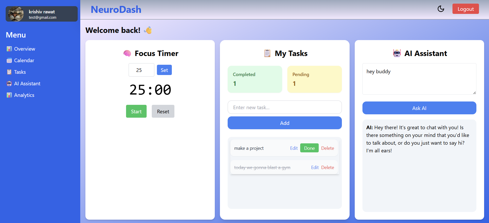
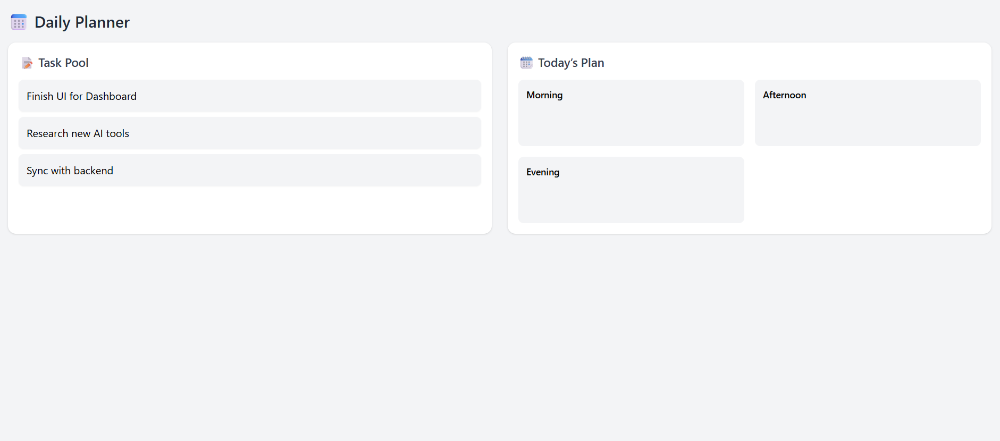
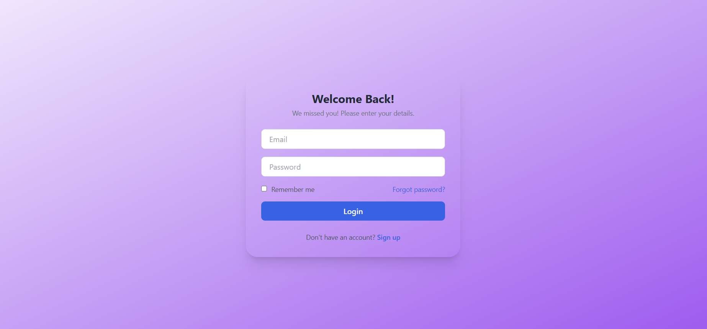
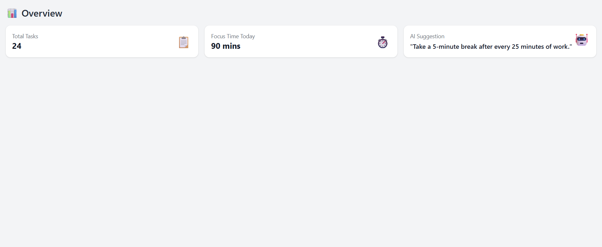

# 🧠 AI-Powered Productivity Dashboard

A full-stack, intelligent productivity platform that helps users manage their time and tasks efficiently using AI, real-time tracking, and elegant design.

Built using the **MERN stack** (MongoDB, Express.js, React / Next.js, Node.js) with secure auth, drag-and-drop planning, Pomodoro focus tools, and OpenAI-powered suggestions.

---

## 🚀 Features

### ✅ Core Functionality
- 🔐 **JWT Authentication** – Signup, login, protected routes, user data stored securely
- 📅 **Drag & Drop Daily Planner** – Schedule tasks for morning, afternoon, evening slots
- 📋 **Task Manager** – Create, edit, delete, and move tasks in real-time
- ⏱️ **Focus Timer** – Pomodoro-based productivity timer with session history tracking
- 🤖 **AI Assistant** – Uses OpenAI API to give productivity advice, summaries, and task suggestions
- 📊 **Analytics Dashboard** – Visual insights with Recharts for focus time and task stats

### 💄 UI & UX Enhancements
- 🌓 Dark mode support
- 📱 Fully responsive & mobile-first design
- 🧭 Sidebar + Top Navbar layout with animated transitions
- 📦 Mobile hamburger menu and protected route redirection
- ✨ Icons (Lucide), Fonts (Google Fonts), Framer Motion for smooth animations

---

## 🧪 Tech Stack

| Tech            | Description                          |
|-----------------|--------------------------------------|
| Next.js / React | Frontend framework                   |
| Node.js         | Backend runtime                      |
| Express.js      | Server-side routing & APIs           |
| MongoDB         | NoSQL database                       |
| Tailwind CSS    | Utility-first CSS framework          |
| JWT             | Auth & route protection              |
| OpenAI API      | AI-powered assistant functionality   |
| Recharts        | Analytics charts                     |
| @hello-pangea/dnd | Drag and drop task planner         |

---

## 📸 Screenshots

### Dashboard Overview  


### Daily Planner  


### Authentication  


### Overview  


---

## 🛠️ Setup Instructions

### 🔧 Prerequisites

- Node.js & npm
- MongoDB (local or cloud)
- OpenAI API Key (for assistant)

### 📦 Installation

```bash
git clone https://github.com/Krishiv-12/NeuroDashboard.git
cd NeuroDashboard

# Install frontend & backend dependencies
npm install

# Rename .env.example to .env and update values
cp .env.example .env


Author-
👨‍💻 Krishiv
MERN Stack Developer | AI Enthusiast


🌟 Show Your Support
If you like this project:

🌟 Star this repo

🛠️ Fork & build on top of it

🔁 Share with your dev friends